## Résumé

Notre offre Platform-as-a-Service automatise le déploiement complet d’une plateforme de supervision et de logging conforme aux standards ANSSI et RGPD, via Terraform et Ansible.
En moins d’une heure, une entreprise obtient une stack prête à l’emploi, avec une application monitorée, hébergée, sécurisée, sans licence ni complexité d’installation.

L'objectif est d'héberger la solution clé en main, sécurisée, le plus économe en ressource et permettre aux entreprises/client de souscrire à un abonnement Cloud permettant de faire bénéficier à tout leur collaborateurs/étudiants de parties de babyfoot endiablés avec les fonctionnalitées proposées dans le projet commun.

La faible consommation (voir les résultats) permettrait facilement un prix d'abonnement faible tout en garantissant une rentabilité.

## Equipe

* Cloud & Infrastructure 1 : TCHOUAR Sabrina
* Cloud & Infrastructure 2 : PELISSIER Thibault

## Technologies utilisées
Les outils suivants au sein de l'infrastructure cible ont été utilisés
* Hyperviseur (virtualisation): Proxmox
* Performance (containerisation): Docker-compose
* Observabilité (Monitoring, alerting, SIEM):Grafana, Loki, Zabbix, htop
* Scalabilité / automatisation (Automatisation): Ansible/Terraform

## ANSSI, CNIL, RGPD
la solution cible proposée respecte les préconisations ANSSI, CNIL et RGPD suivante :

#### Sécurisation :
✅ ANSSI — Recommandations d’architecture réseau
* *(→ Réf : [ANSSI - Bonnes pratiques d’administration sécurisée, 2022])*
        
* Segmentation logique des zones (WAN - DMZ - LAN)

        - observabilité isolé pour Zabbix, Loki, Grafana et MySQL dans le LAN
        - Flux isolés (voir matrice de flux) par les Firewall WAN-DMZ et DMZ-LAN

#### Surveillance et journalisation :
        - Collecte centralisée des métriques (Zabbix) et des logs (Loki)

#### Principe de moindre privilège :
        -Les containers n’ont que les volumes nécessaires (:ro pour les fichiers de conf), pas d’accès root global.
✅ Respect des mesures de durcissement préconisées par l’ANSSI (fiche MCS – durcissement Docker/VM).

✅ conforme au guide de journalisation Windows/Linux de l’ANSSI (réf. v2.1 2020).

#### Traçabilité & intégrité :
        -Les journaux sont centralisés sans modification manuelle possible
✅ recommandation CNIL du 18/10/2022 sur la sécurité des journaux d’accès.
#### Protection d’accès :
        -Les interfaces Grafana/Zabbix sont accessibles en local, protégées par authentification
✅ conforme aux principes de “confidentialité par défaut” (art. 25 RGPD).

## Objectifs Infra (✅ atteint, ❌ non atteint):

#### Rapidité & Industrialisation

* ❌ Déploiement automatisé en moins d’une heure grâce à Terraform (infrastructure) et Ansible (configuration applicative).

    🔧 Zéro intervention manuelle : tout est codé en Infrastructure-as-Code.

    ⏱️ Scalabilité instantanée : une nouvelle instance client peut être déployée en quelques minutes.

    💾 Rollbacks garantis : chaque version de déploiement est versionnée et traçable via GitLab CI/CD.

    🟩 → Valeur : réduction de 80 % du temps d’intégration par rapport à une installation manuelle.

❌ > manque de temps pour l'automatisation totale de l'infrastructure.

des pistes ont été étudiés pour la récupération de rôles ansible afin d'intégrer dans un playbook l'installation du docker compose, la configuration de règles firewall automatique.

des pistes ont été étudiés pour le déploiement automatique des VMs,l'installation du ssh sur l'hyperviseur Proxmox avant d'éxecuter les playbooks ansible contruits afin de terminer l'automatisation

le playbook actuel ne contenait que la possibilitée d'exécuter la commande fournie dans le guide de déploiemment (docker compose up -d) sur les VM configurées depuis l'ansible Master vers ses cibles.

#### Sécurité & Conformité

L’architecture est alignée avec les recommandations ANSSI et RGPD.

    🔐 Segmentation réseau (zone Observability dédiée).

#### Supervision complète clé en main

Une plateforme unifiée de supervision et de logging.

    📊 Zabbix pour la collecte de métriques systèmes et applicatives.
        - Zabbix récupère grâce à l'agent configuré automatiquement les nouveaux containeurs ajoutés et propose alertes et 
    📜 Loki/Promtail pour les journaux temps réel.

    🧭 Grafana comme tableau de bord consolidé.
        - Il est possible d'ajouter Loki en SIEM sur grafana, ainsi que Zabbix afin de centraliser l'entièreté des données.
    🗄️ MySQL intégré pour héberger les applications métier clientes.

## Schéma d'infrastructure cible (✅ atteint, ❌ non atteint)
l'infrastructure comme précisée précédemment a étée pensée afin d'intégrer une offre cloud à divers client.

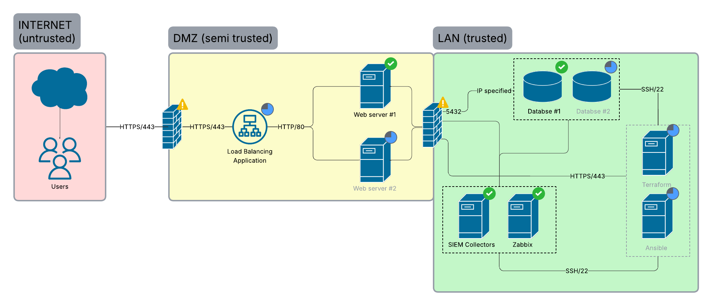

## Guide de déploiement

#### prérequis
* Hyperviseur Proxmox
* VM debian en Lan et en DMZ avec docker et docker-compose d'installé
* Firewall installés et configurés suivant les règles de flux suivant :

📄 [Voir le fichier Excel](babyfoot_flux_matrix.xlsx)

#### commandes

depuis les VM debian :

#### LAN
insérez le fichier complet décompressé docker.tar dans la vm debian du lan. lancez la commande

        docker compose up -d

⚠️ Une configuration plus avancée du service de la base de donnée sera nécéssaire afin d'intégrer les traitement des données DATA/IA.

#### DMZ
insérez le fichier complet décompressé dans la vm debian du lan. supprimez le fichier docker-compose.yml, et renommez le fichier docker-compose-DMZ.yml en docker-compose.yml, enfin, exécutez la commande

        docker compose up -d

⚠️ le containeur de l'application web du pôle developpement doit être intégrée dans les services déjà existants afin d'obtenir l'application fonctionnelle actuellement.

## Estimation coûts

Les couts ont étés évalués suivant :
le cout de mise en oeuvre (avec la définition des étapes) main d'oeuvre et hors main d'oeuvre
le cout de maintien en condition opérationnel main d'oeuvre et hors main d'oeuvre

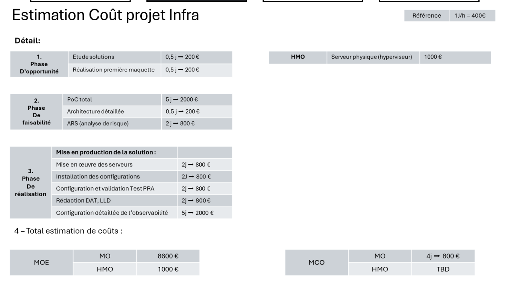

## Estimation Planning

les tâches sont estimées, et réalisées selon les processus de phase d'opportunité, de faisabilité, et de réalisation de projet. elles ont été établies en partant du principe qu'il sera nécéssaire d'obtenir validation de l'ensemble du corps (ou de responsable si le projet est au sein d'une entreprise) au sein d'instances représentées par des ⭐.

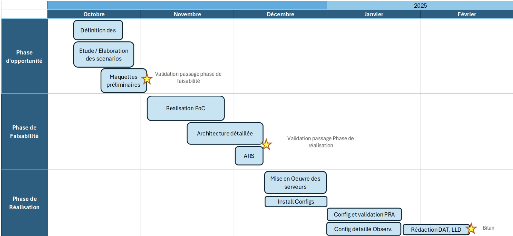

## résultats de mise en oeuvre

si tu peux mettre les différents screen de résultat ici
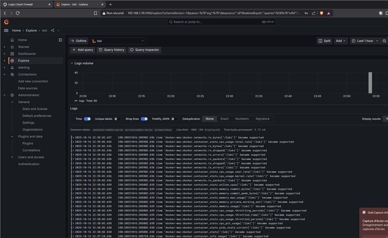
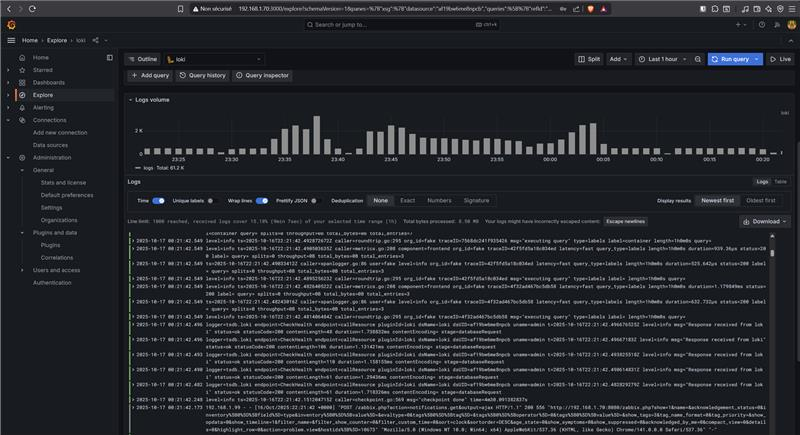
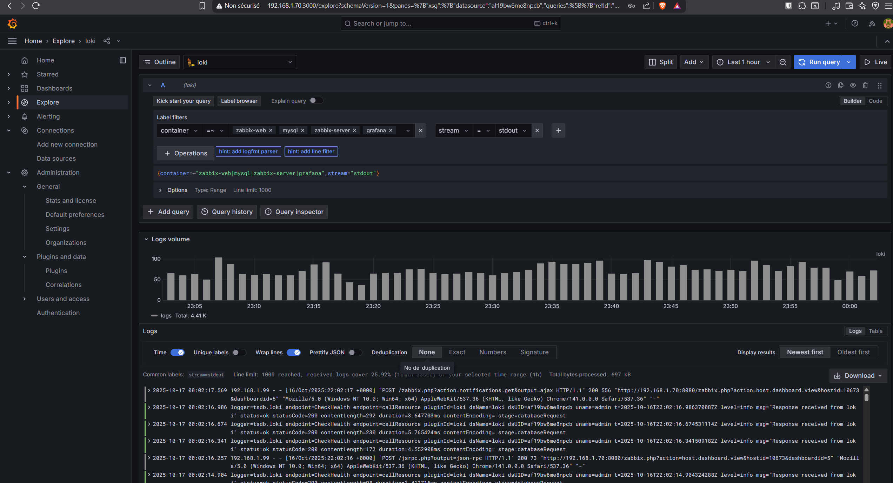
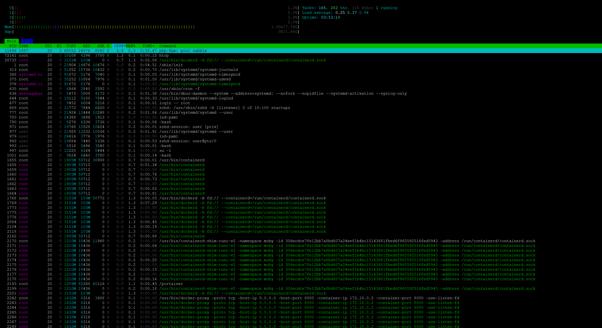
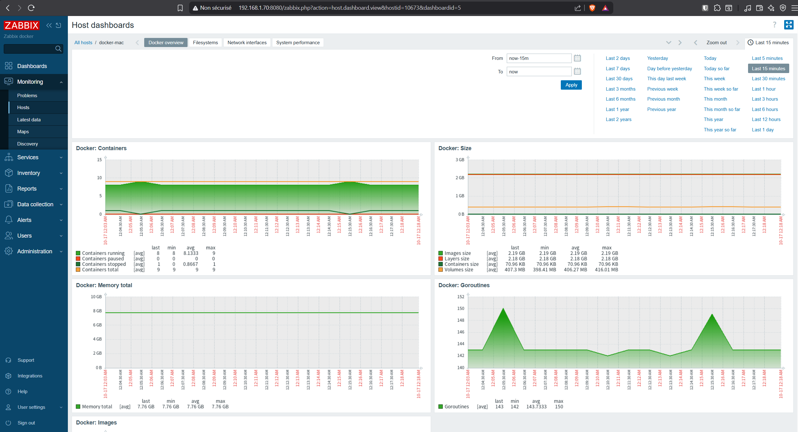
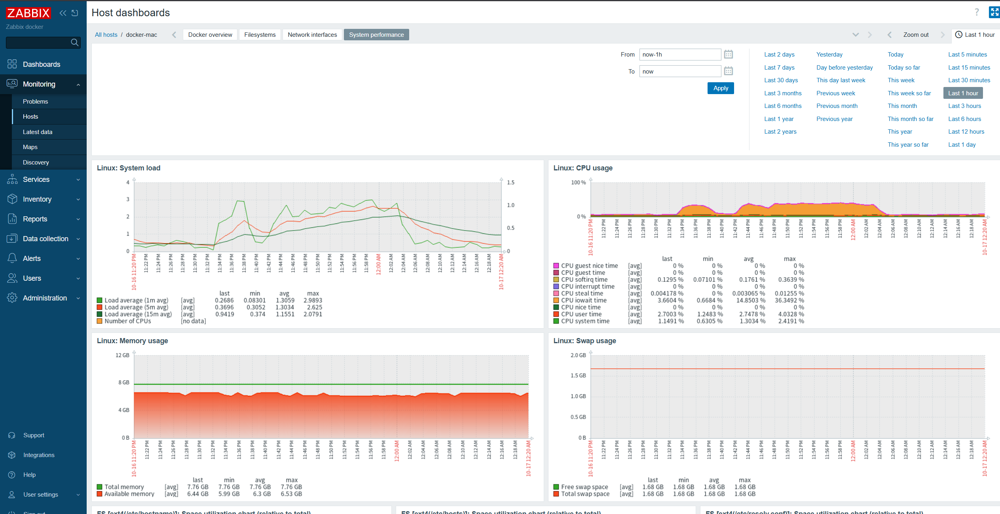

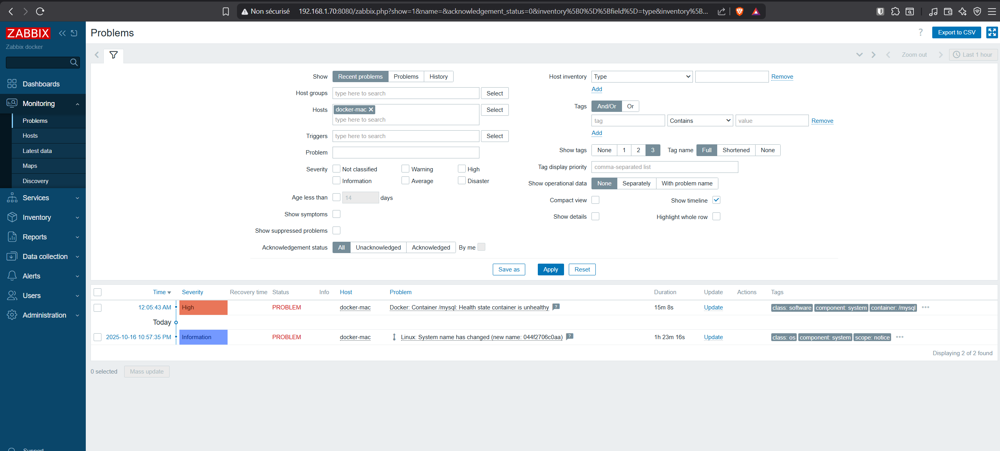
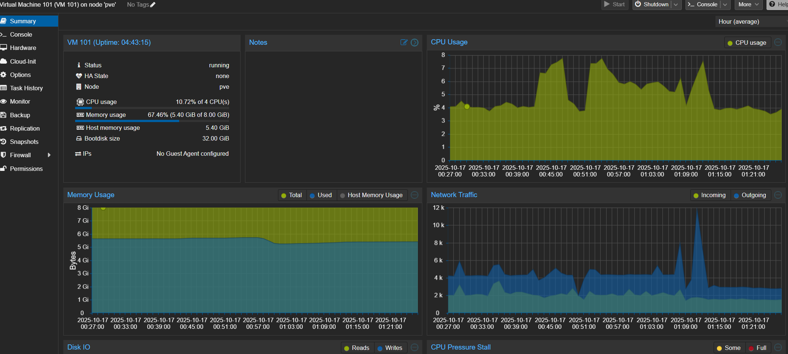

## Plan de Reprise d'Activité (PRA) et Politique de Sauvegarde

### PRA
Un Plan de Reprise d'Activité (PRA) a été conçu pour garantir la continuité de service en cas de sinistre. Les principales étapes incluent :
- **Sauvegarde régulière des données critiques** : Les données des bases de données et des journaux sont sauvegardées quotidiennement sur un stockage externe sécurisé.
- **Redondance des services** : Les services critiques (Zabbix, Grafana, Elasticsearch) sont configurés pour redémarrer automatiquement en cas de panne.
- **Tests réguliers** : Des simulations de sinistres sont effectuées pour valider l'efficacité du PRA.

### Duplication des données avec RAID5
Pour garantir la disponibilité et l'intégrité des données, un système RAID5 a été mis en place :
- **RAID5** : Permet de répartir les données sur plusieurs disques tout en offrant une tolérance aux pannes. En cas de défaillance d'un disque, les données peuvent être reconstruites à partir des disques restants.

insérer un schéma sur RAID 5

- **Avantages** :
  - Tolérance à une panne de disque.
  - Optimisation de l'espace disque disponible.
  - Performances accrues en lecture.

Cette configuration assure une politique de sauvegarde robuste et conforme aux exigences de sécurité.

## Axes d'Amélioration

Bien que les objectifs principaux aient été atteints, plusieurs axes d'amélioration peuvent être envisagés :
1. **Automatisation complète** :
   - Finaliser l'intégration des rôles Ansible pour automatiser entièrement le déploiement des VMs et des configurations réseau.
   - Ajouter des scripts pour la gestion dynamique des règles de firewall.
2. **Optimisation des performances** :
   - Réduire la consommation des ressources des conteneurs en ajustant les limites CPU/mémoire.
   - Mettre en place un système de cache pour les services les plus sollicités.
3. **Renforcement de la sécurité** :
   - Ajouter des mécanismes de détection d'intrusion (IDS/IPS).
   - Mettre en œuvre une gestion centralisée des certificats SSL.
4. **Scalabilité** :
   - Étudier l'intégration de Kubernetes pour une gestion plus avancée des conteneurs.
   - Permettre un déploiement multi-régions pour les clients internationaux.

## Conclusion : Proposition du Projet en Cloud

Le projet présente une solution clé en main, sécurisée et conforme aux standards ANSSI et RGPD. En proposant cette solution sous forme d'abonnement Cloud, les campus intéréssés peuvent bénéficier des avantages suivants :
- **Accessibilité** : Une plateforme prête à l'emploi, accessible depuis n'importe où.
- **Évolutivité** : Possibilité d'ajouter des ressources ou des fonctionnalités à la demande.
- **Maintenance simplifiée** : Les mises à jour et la supervision sont gérées par l'équipe Cloud.

En conclusion, cette solution Cloud offre une opportunité unique de moderniser les infrastructures des entreprises tout en garantissant sécurité, conformité et performance.